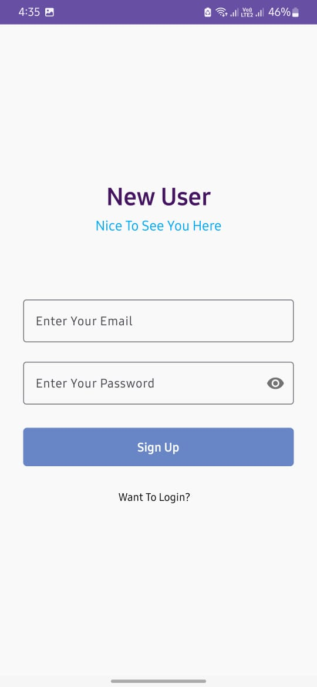
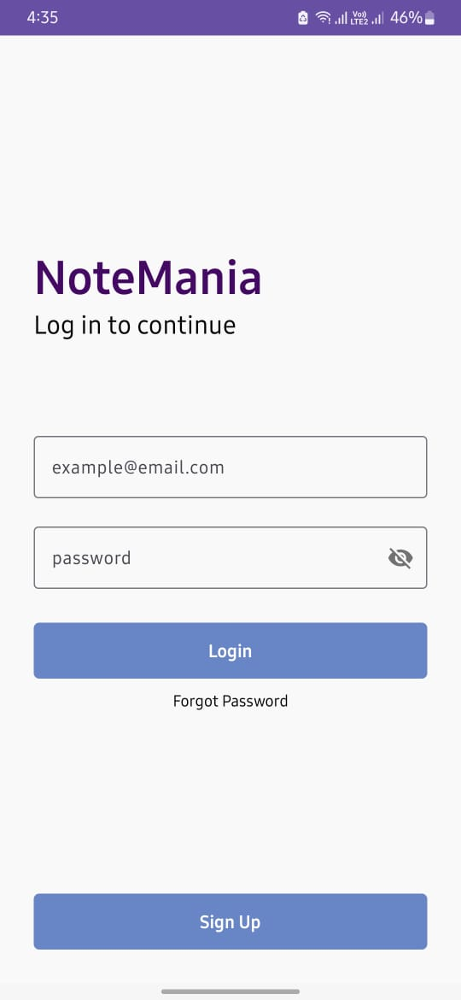
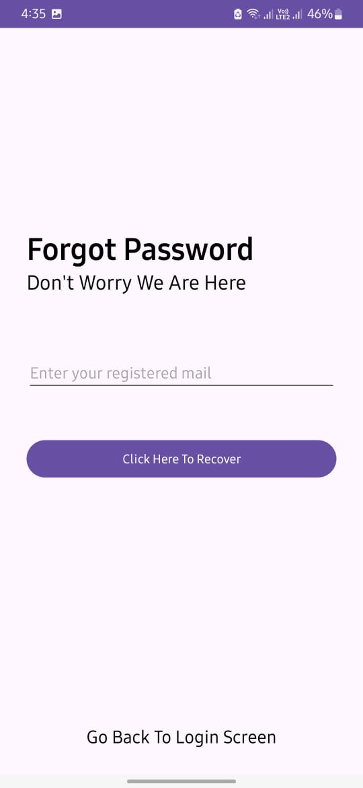
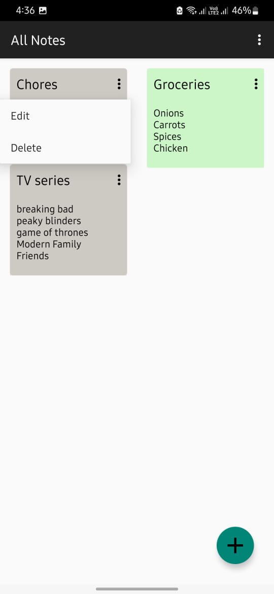
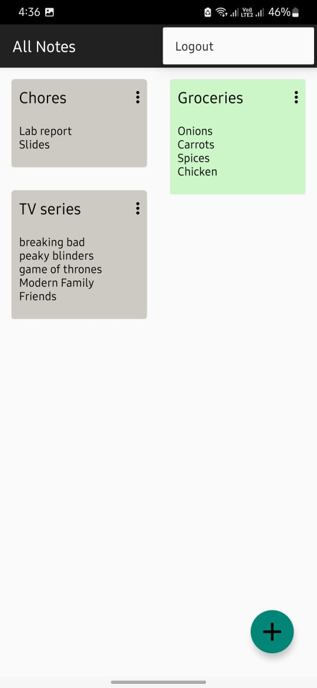

# NoteMania

## Overview
NoteMania is an Android application designed to help users manage their notes efficiently.

## Features
- Sign Up
- Login with email verification
- Forgot Password
- Create Notes
- Edit Notes
- Delete Notes
- View Notes
- Logout

## Screenshots
### Sign Up

### Login with Email Verification

### Forgot Password

### Create, Edit, and Delete Notes

### Logout

## Project Details
This project was developed as part of the course **Software Engineering and Information Systems Laboratory (CSE 3120)** at **Khulna University of Engineering and Technology**.

- **Platform**: Android
- **Language**: Java
- **Build Configuration Language**: Groovy DSL
- **Database Used**: Firebase
- **IDE Used**: Android Studio
- **Design Pattern Implemented**: Singleton Design Pattern
- **Testing Completed**: Continuous Integration, UI Test
- **Contributors**:
  - [Atikur Rahman Asib](https://github.com/Asib-104) 
  - [Bishal Roy](https://github.com/IronDigger098)
  - [Faiyaz Mahmud](https://github.com/faiyaz103)
